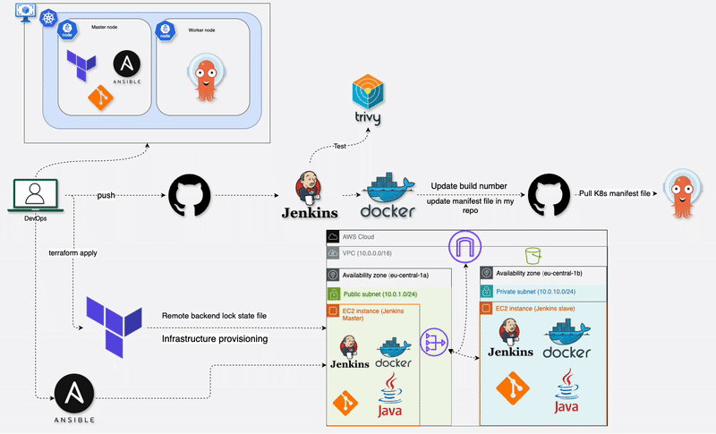
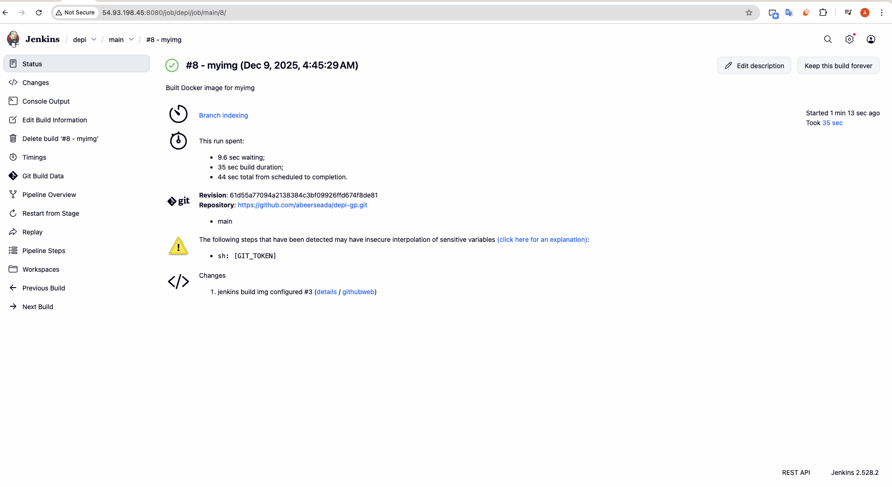
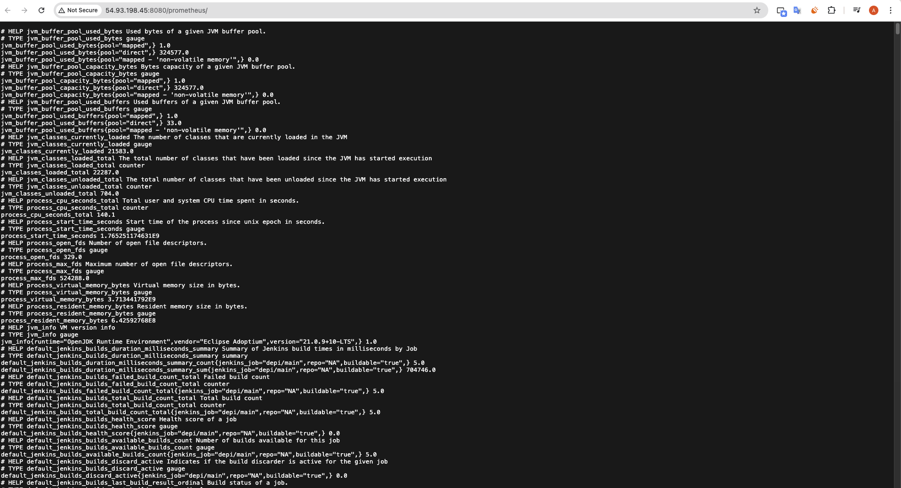
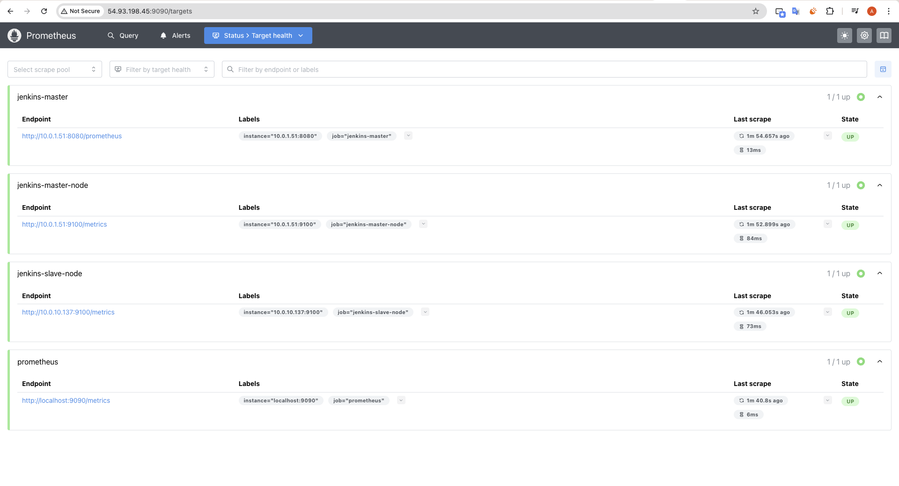
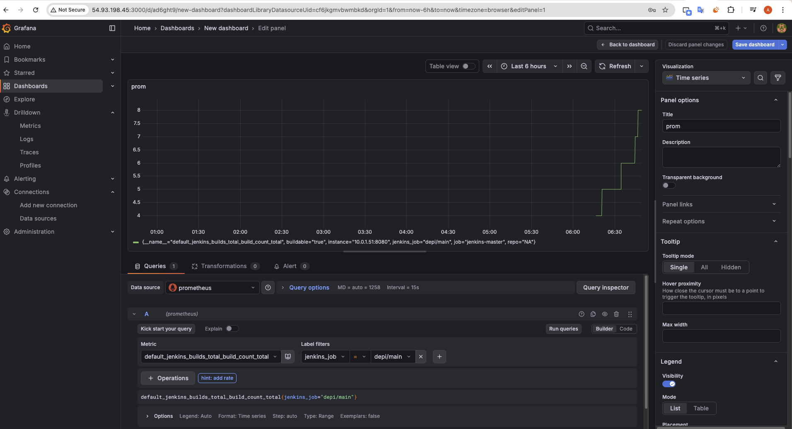
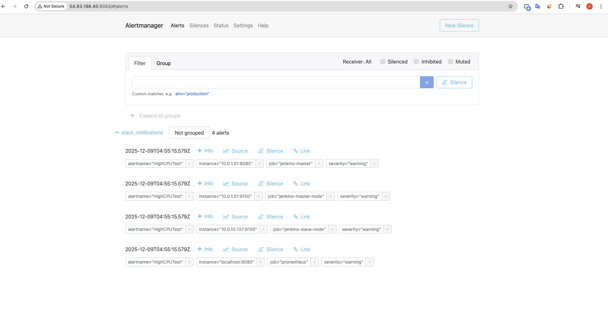
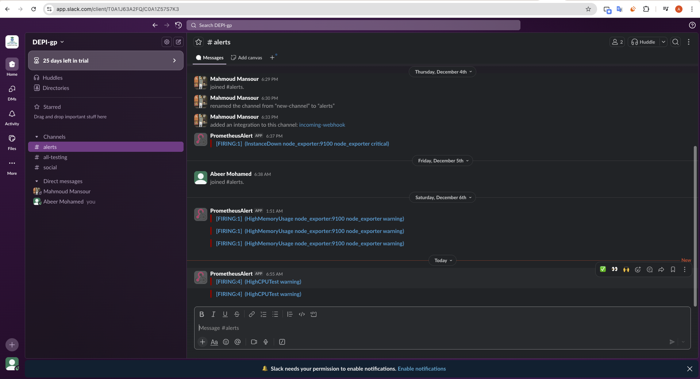
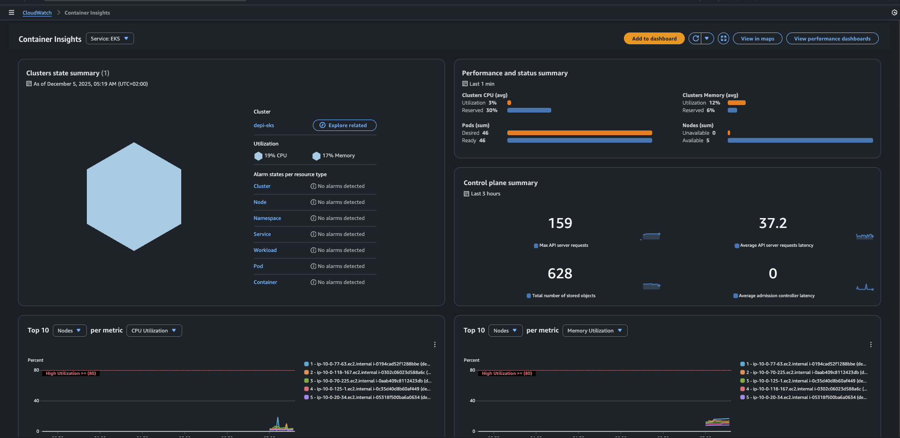
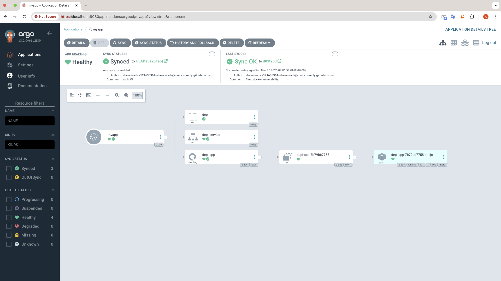
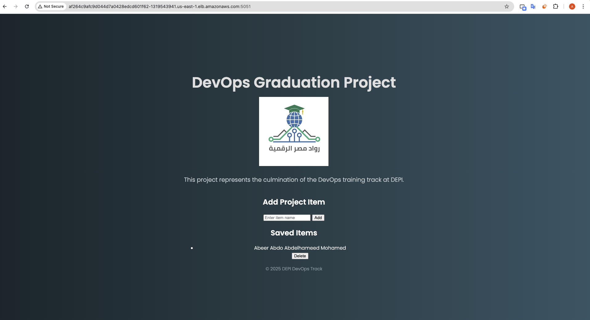

# DevOps Graduation Project

<p align="center">
      
  
</p>

<h3 align="center">In Collaboration with Depi </h3>

<p align="center">
  Final project for the DEPI DevOps program, containerizing and orchestrating a Python web app using Docker and Kubernetes.
</p>

<h3 align="center"> This is the architecture diagram </h3>
<p align="center">

</p>

---

# **DEPI Graduation Project: Full DevOps CI/CD Pipeline**

A complete DevOps pipeline built using **Terraform**, **Ansible**, **Jenkins**, **Docker**, **Kubernetes**, and **ArgoCD**, enabling automated build and deployment from GitHub commits to a running Kubernetes application.

This project also includes **full EKS monitoring using CloudWatch**, **email alerting through SNS**, and **automatic worker node scaling using Kubernetes Cluster Autoscaler**, making it production-ready and self-healing.

Also includes **full Jenkins monitoring using Prometheus**, **alerting through Slack**

---

## **Project Overview**

This project implements a fully automated CI/CD workflow:

- **Terraform** provisions AWS infrastructure (VPC, Subnets, EC2 instances).
- **Ansible** configures Jenkins Master and Slave nodes.
- **Jenkins** builds, scans, and pushes Docker images.
- **ArgoCD** deploys updated Kubernetes manifests automatically.
- **DockerHub** hosts application images.
- **GitHub Webhooks** trigger Jenkins on every code push.
- **Prometheus Monitoring + Alerts** give full visibility of Jenkins nodes health.
- **CloudWatch Monitoring + Alerts** give full visibility of cluster health.
- **Cluster Autoscaler** ensures the EKS cluster scales up/down automatically based on workload.

This creates a complete end-to-end GitOps workflow.

---

## **Architecture Summary**

### **Infrastructure (Terraform)**

- VPC CIDR: `10.0.0.0/16`
- Public Subnet: `10.0.1.0/24`
- Private Subnet: `10.0.10.0/24`
- Internet Gateway + NAT Gateway
- EC2 Instances:

  - **Jenkins Master** (Public subnet)
  - **Jenkins Slave/Agent** (Private subnet)

- S3 bucket to store Terraform state

### **Configuration (Ansible)**

- Install Docker, Git, Java
- Configure Jenkins Master container
- Prepare Jenkins Slave as a build agent

### **CI (Jenkins)**

Pipeline stages:

1. Checkout source from GitHub
2. Build Docker image
3. Scan image with Trivy
4. Push image to DockerHub
5. Update Kubernetes manifests
6. Commit and push changes back to GitHub

### **CD (ArgoCD + Kubernetes)**

- ArgoCD watches the `k8s/` folder in the repo
- Auto-deploys whenever image tags change
- Kubernetes hosts the running application in namespace `depi`

---

## **Terraform Deployment**

### **Initialize & Apply**

```bash
cd terraform
terraform init
terraform plan -out plan.tfplan
terraform apply "plan.tfplan"
```

Terraform automatically stores state in the S3 bucket configured in `backend.tf`.

---

## **Ansible Configuration**

### **Run playbooks**

```bash
cd ansible
ansible-playbook -i hosts.ini site.yml
ansible-playbook -i hosts.ini jenkins_master.yml
ansible-playbook -i hosts.ini node-exporter.yml
ansible-playbook -i hosts.ini apply_monitoring.yml
```

This sets up:

- Docker engine
- Jenkins Master container
- Jenkins Slave tooling
- Required permissions (docker group, SSH, etc.)
- Grafana and Prometheus and node exporter on targets

---

## **Jenkins Pipeline**

Each stage is written as a Groovy shared library step under `ci/steps/`.

### **Main Pipeline (`Jenkinsfile`) includes:**

- Build Docker image
- Push image to DockerHub
- Security scan with Trivy
- Update Kubernetes YAML files
- Commit & push back to GitHub

<h3 align="center"> This is the architecture diagram </h3>
<p align="center">

</p>
Webhook from GitHub triggers the pipeline automatically.

<h3 align="center"> This is the architecture diagram </h3>
<p align="center">

</p>

<h3 align="center"> This is the architecture diagram </h3>
<p align="center">

</p>

<h3 align="center"> This is the architecture diagram </h3>
<p align="center">

</p>

<h3 align="center"> This is the architecture diagram </h3>
<p align="center">

</p>

<h3 align="center"> This is the architecture diagram </h3>
<p align="center">

</p>

---

## **Kubernetes + ArgoCD Deployment**

# **4️ Create EKS Cluster**

```bash
eksctl create cluster -f cluster.yaml
aws eks update-kubeconfig --region us-east-1 --name depi-eks
kubectl get nodes
```

Creates EKS with private nodes.

# **EKS Monitoring (Amazon CloudWatch + FluentBit + SNS Email Alerts)**

The EKS cluster is fully integrated with **Amazon CloudWatch Container Insights**, providing:

- Node CPU & Memory monitoring
- Pod-level performance metrics
- Application logs using **FluentBit**
- Infrastructure health dashboards
- Autoscaling event logs
- Error and crash detection

### **Email Alerts using SNS → Gmail**

SNS notification system triggers email alerts on:

- High CPU or memory on worker nodes
- Node failures or unresponsiveness
- Pods stuck in Pending / CrashLoopBackOff
- Autoscaler failures to scale up/down
- Any CloudWatch alarm thresholds

This ensures early detection and fast remediation.

<p align="center">

</p>

---

# **Cluster Autoscaler on EKS**

The **Cluster Autoscaler** is deployed to automatically scale the worker nodes inside the EKS cluster.

### Features:

- Scales **up** when pods cannot be scheduled
- Scales **down** when nodes become underutilized
- Integrates with **AWS Auto Scaling Groups**
- Fully supports **multi-AZ nodegroups**
- IAM roles configured via OIDC for autoscaler permissions

### Autoscaler Benefits:

- Guarantees application availability
- Reduces AWS cost by removing idle nodes
- Enhances reliability during high traffic loads
- Works seamlessly with ArgoCD deployments

Autoscaler logs are available under:

```bash
kubectl logs -n kube-system -l app=cluster-autoscaler
```

### **Application Definition**

Located at:

```
k8s/
 ├─ configmap-app.yaml
 ├─ deployment.yaml
 ├─ gp2-csi-sc.yaml
 ├─ mongo-statefulset.yaml
 ├─ namespace.yaml
 ├─ secret-mongo.yaml
 └─ service.yaml

```

### **ArgoCD Application**

<p align="center">


</p>

```bash
k apply -f /argocd-app.yaml
```

### **ArgoCD Sync**

```bash
argocd app sync myapp
argocd app get myapp
```

---

## **End-to-End Workflow**

1. Developer pushes code → GitHub
2. GitHub Webhook triggers Jenkins
3. Jenkins builds, scans, pushes Docker image
4. Jenkins updates Kubernetes manifests
5. GitHub commits → ArgoCD auto-syncs
6. EKS deploys updated application
7. CloudWatch monitors cluster health
8. Autoscaler adjusts worker nodes automatically
9. Application becomes live and self-healing on AWS

---

## **Useful Commands**

### **ArgoCD**

```bash
kubectl -n argocd port-forward svc/argocd-server 8080:443
argocd login localhost:8080
argocd app list
```

### **Kubernetes**

```bash
kubectl get pods -n depi
kubectl describe deployment -n depi
```

### **Terraform**

```bash
terraform destroy
```

### **EKS delete cluster**

```bash
eksctl delete cluster --name depi-eks --region us-east-1
```

---

# **Conclusion**

This project demonstrates a real-world DevOps workflow:

- Infrastructure as Code
- Automated configuration management
- Continuous Integration
- Continuous Delivery
- GitOps deployment with ArgoCD
- Full observability with CloudWatch + SNS alerts + Prometheus + Grafana
- Automatic scaling with Cluster Autoscaler

The system is now **scalable, observable, fault-tolerant, and production-ready.**
